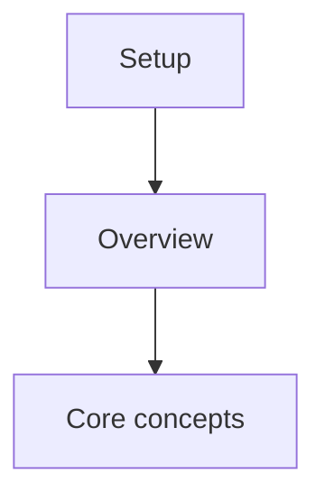
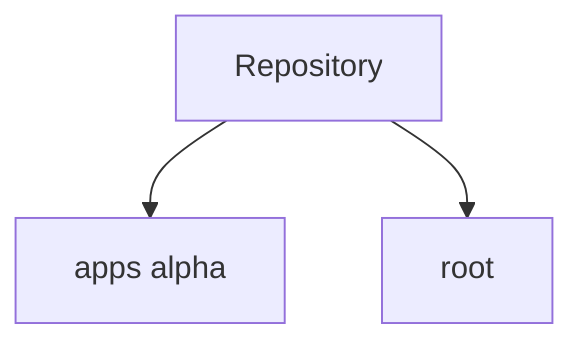

# Tutorial Index

## How to use this tutorial

Read Setup first, then follow the learning path.

## Module inventory

## Chapters

- [Setup](00_setup.md)
- [Overview](01_overview.md)
- [Core concepts](02_core.md)
